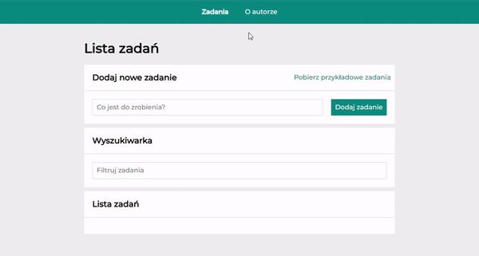
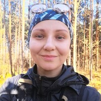

# **Todo list**
This project was bootstrapped with [Create React App](https://github.com/facebook/create-react-app).

## **Demo**: 
[Please click here to use my taskList](https://katarzynazaloba.github.io/todo-list-react2/)

## **How it works**

The task list is in Polish. You can add there your task, select it as done, delete task, search tasks by keyword, set all as done by clicking on "Ukończ wszystkie" and hide all of done tasks by clicking "Ukryj ukończone". In the navbar there are hiperlinks to the author and to tasks.

 ## **Technologies used in the project**
To create the application I have used:
- HTML
- CSS
- Normalize
- BEM convention
- JavaScript
- ES6+ features
- GIT
- Markdown
- Redux.

## **Available Scripts**

In the project directory, you can run:

### ` - npm run build`

Builds the app for production to the `build` folder.\
It correctly bundles React in production mode and optimizes the build for the best performance.

The build is minified and the filenames include the hashes.\
Your app is ready to be deployed!

See the section about [deployment](https://facebook.github.io/create-react-app/docs/deployment) for more information.

### `- npm run eject`

**Note: this is a one-way operation. Once you `eject`, you can't go back!**

If you aren't satisfied with the build tool and configuration choices, you can `eject` at any time. This command will remove the single build dependency from your project.

Instead, it will copy all the configuration files and the transitive dependencies (webpack, Babel, ESLint, etc) right into your project so you have full control over them. All of the commands except `eject` will still work, but they will point to the copied scripts so you can tweak them. At this point you're on your own.

You don't have to ever use `eject`. The curated feature set is suitable for small and middle deployments, and you shouldn't feel obligated to use this feature. However we understand that this tool wouldn't be useful if you couldn't customize it when you are ready for it.

## **About me** ## 

Hello everyone! My name is Katarzyna. I used to work in **`IT department`** for the last circa 3 years as an **`IT Process Coordinator`**. I gained experience as a **`Personal Data Officer`** since Nov 2021 too. 
Impossible? Nothing is impossible if you are really into something! 
I was resposible for the procedures and instructions related with quality in the organization. As you can see my mind is open and I like to learn new things. 
Since Dec 2022 I am developing my skills in my *`Frontend Developer course by YouCode`*. 

And I will stand with this.

In my free time I am jogging through the forest near my home - in my opinion it's the best solution for your body and mind!

That's it from me for now. If you would like to know more about my eperience, please visit my [Linkedin](https://www.linkedin.com/in/katarzyna-zaloba/) .

